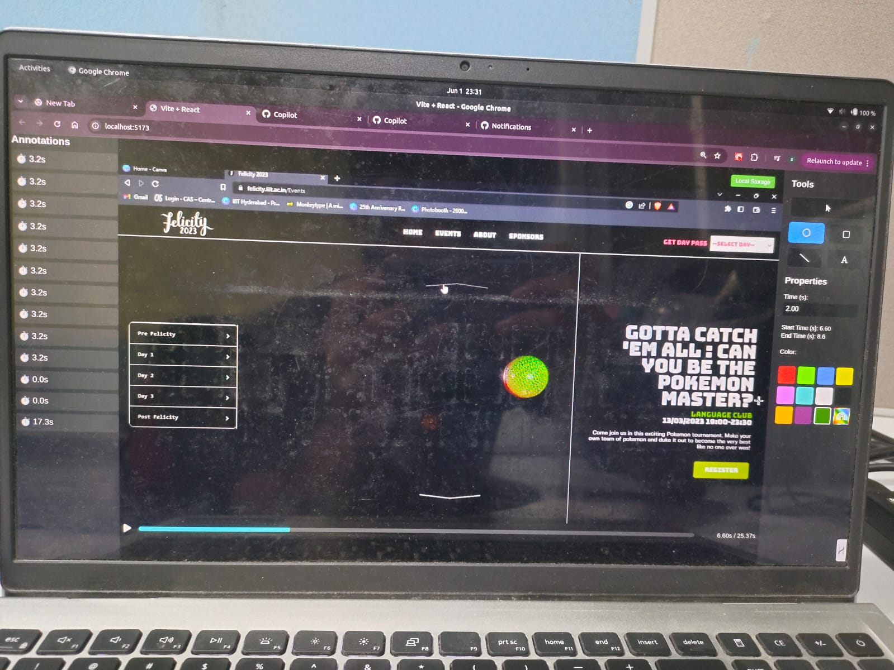

# Video Annotation Tool

A modern web-based video annotation tool that enables users to add timestamped visual and text-based annotations on a video timeline. Inspired by YouTube’s UX but tailored for drawing and annotation management, this tool provides an intuitive interface for reviewing video content with contextual, time-based annotations. It is highly suitable for education, content review, media production, or any use case that benefits from visual tagging on videos.

---

## Why This Matters

Video is the most consumed form of media today, yet tools to annotate or review video content with precision and structure are limited. **This tool bridges that gap** by letting users:

* Annotate specific moments in videos with shapes or text.
* Interact with annotations through selection, drag, and timeline-based visibility.
* Review content with more clarity in collaborative or solo environments.

It supports localStorage for lightweight use and API-based persistence for more scalable scenarios—perfectly suiting low-scale or fast iteration projects, educational settings, and prototyping.

---

## Project Structure

```
.
├── backend/              # Express server with file-based annotation storage
│   ├── annotations.json
│   ├── package.json
│   └── server.js
├── frontend/             # Vite-powered React frontend
│   ├── public/           # Video assets and static files
│   ├── src/
│   │   ├── components/   # Core UI components
│   │   ├── hooks/        # Custom logic for annotations and video interaction
│   │   ├── App.jsx       # Main app structure
│   │   └── styles.css
│   ├── index.html
│   └── vite.config.js
└── README.md
```

---

## Design Decisions

* **Vite + React** for fast development and modular code organization.
* **File-based storage** via JSON for simplicity and rapid iteration in a low-scale setup.
* **Vercel (frontend) & Render (backend)** are used for deployment due to their seamless GitHub integration and zero-config builds, ensuring rapid updates on code changes.
* **Modular architecture** using components and hooks allows separation of concerns and better testability.

---

## Features

### Core

*  Custom video player (YouTube-style)
*  Circle, rectangle, line, and text annotation tools
*  Timeline-based annotation visibility (2–3 seconds window)
*  Annotation selection and drag-to-move
*  Deletion with Delete key or button
*  Undo/Redo for all annotation actions
*  Dual-mode storage: localStorage & backend API

### Enhanced UI

* Frame-by-frame navigation
* Playback speed control (0.5x to 2x)
* Timeline markers for annotations
* Keyboard shortcuts (C, R, L, T, Delete, Ctrl+Z, etc.)
* Responsive design for desktop, tablet, mobile

---

## Components Overview

| Component                     | Purpose                                         |
| ----------------------------- | ----------------------------------------------- |
| `Video.jsx`                   | Custom video player with timeline integration   |
| `AnnotationRenderer.jsx`      | Renders annotation shapes and handles selection |
| `TextInput.jsx`               | Inline editing for text annotations             |
| `StorageToggle.jsx`           | UI switch between local and API storage         |
| `TaskBar.jsx` & `ToolBar.jsx` | Drawing tool UI and controls                    |
| `AnnotationList.jsx`          | Sidebar for viewing and managing annotations    |

---

## Custom Hooks

* **`useAnnotationStorage.jsx`** – Manages save/load from API or localStorage
* **`useDrawing.jsx`** – Handles drawing logic for all shape tools
* **`useAnnotationInteraction.jsx`** – Supports selection, dragging, and deletion
* **`useTextAnnotation.jsx`** – Enables text input/edit mode
* **`useVideoControls.jsx`** – Binds video player controls and time updates

---

## Technology Stack

### Frontend

* React + Vite
* Modern CSS
* ESLint

### Backend

* Node.js + Express
* JSON-based file storage (`annotations.json`)
* CORS enabled

---

## Setup Instructions

### Backend

```bash
cd backend
npm install
npm start  # runs at http://localhost:3001
```

### Frontend

```bash
cd frontend
npm install
npm run dev  # runs at http://localhost:5173
```

---

## Deployment

### Frontend

* Deployed on **Vercel**
* Build command: `vite build`
* Output directory: `dist`

### Backend

* Deployed on **Render**
* Simple Express.js server with file storage

---

## API Documentation

### Base URL

`https://your-backend-url.com/api`

| Method   | Endpoint                | Description                 |
| -------- | ----------------------- | --------------------------- |
| `GET`    | `/annotations/:videoId` | Get annotations for a video |
| `POST`   | `/annotations`          | Create a single annotation  |
| `POST`   | `/annotations/bulk`     | Save multiple annotations   |
| `PUT`    | `/annotations/:id`      | Update an annotation        |
| `DELETE` | `/annotations/:id`      | Delete an annotation        |
| `DELETE` | `/annotations`          | Delete all annotations      |

> Example request and response payloads are already included above.

---

## Keyboard Shortcuts

| Key                       | Action              |
| ------------------------- | ------------------- |
| `Space`                   | Play/Pause          |
| `←` / `→`                 | Seek                |
| `Ctrl+Z`                  | Undo                |
| `Ctrl+Shift+Z` / `Ctrl+Y` | Redo                |
| `C`, `R`, `L`, `T`        | Select drawing tool |
| `Delete`                  | Delete annotation   |

---

## Screenshots




---

## Assumptions & Notes

* Video must be paused to create annotations.
* Annotations are shown for \~2–3 seconds based on the current timestamp.
* Storage mode (local/API) can be toggled for flexibility during development or demo purposes.
* GitHub-linked deployment via Vercel and Render enables CI-style workflows.

---

## Optional Enhancements Considered

* Accessible keyboard shortcuts
* Real-time annotation rendering
* Timeline markers
* Undo/Redo system
* Drawing tool icons and UX refinements

---

## Contributing

```bash
git clone https://github.com/Sudhankd/VideoAnnotationTool
cd VideoAnnotationTool
# Create a new branch
git checkout -b feature/my-feature
# Make changes, commit and push
git commit -m "Added feature"
git push origin feature/my-feature
```

---

## Submission Summary

Here’s a clean and professional formatting of your deployment and submission links section in Markdown:

---

## Submission Links

* **Frontend Live Demo**: [https://video-annotation-tool-six.vercel.app/](https://video-annotation-tool-six.vercel.app/)
* **Backend API**: [https://videoannotationtool.onrender.com](https://videoannotationtool.onrender.com)
* **GitHub Repository**: [https://github.com/Sudhankd](https://github.com/Sudhankd)
* **Video Demo**: [Watch the demo video](https://iiithydstudents-my.sharepoint.com/:v:/g/personal/duggi_yashwanth_students_iiit_ac_in/ESFmVc4XQgJJnz9xKtPYjwEB-PpGFaslssm--zgaX9ZkOg?e=CVJ8fX&nav=eyJyZWZlcnJhbEluZm8iOnsicmVmZXJyYWxBcHAiOiJTdHJlYW1XZWJBcHAiLCJyZWZlcnJhbFZpZXciOiJTaGFyZURpYWxvZy1MaW5rIiwicmVmZXJyYWxBcHBQbGF0Zm9ybSI6IldlYiIsInJlZmVycmFsTW9kZSI6InZpZXcifX0%3D)

---

